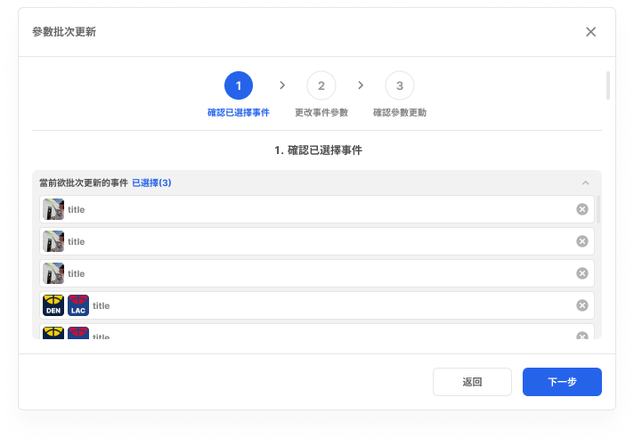
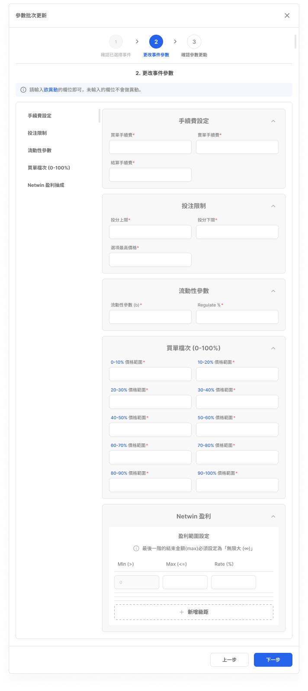
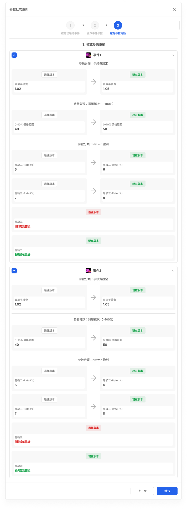

# 批次事件參數更新

- 文件狀態：可供查詢，操作規則待確認
- 所屬模組：事件設置
- 最後更新：2026-09-23

## 功能說明

用來對多個已選事件批次修改參數。畫面呈現「確認已選擇事件 → 更改事件參數 → 確認參數更動」三個階段。

## 畫面與簡單說明

### Step 1：確認已選擇事件

- 顯示目前準備批次更新的事件清單。
- 使用者可先確認或移除事件，再進入下一步。
- [在 Figma 開啟來源畫面](https://www.figma.com/design/UX9EY190SGnpNiowHlwiUB?node-id=121-294349)

### Step 2：更改事件參數

- 輸入要批次更動的參數；畫面說明未輸入的欄位不會被更動。
- 可見分類包含手續費、投注限制、流動性參數、買單檔次與 Netwin 盈利。
- [在 Figma 開啟來源畫面](https://www.figma.com/design/UX9EY190SGnpNiowHlwiUB?node-id=121-294377)

### Step 3：確認參數更動

- 依事件顯示過往版本與現在版本，讓使用者執行前確認差異。
- 畫面可呈現數值修改，以及新增或刪除層級等變動。
- [在 Figma 開啟來源畫面](https://www.figma.com/design/UX9EY190SGnpNiowHlwiUB?node-id=121-293818)

## 操作流程

1. 確認要更新的事件。
2. 輸入要批次更動的參數。
3. 檢查各事件的更新前後差異並執行。

目前可以確認畫面上呈現這三個階段；入口條件、資料保存及實際執行結果仍待確認。

## 各單位可以先使用的資訊

| 單位 | 可使用資訊 |
|---|---|
| 規劃／產品 | 可依三個畫面階段討論流程；權限、取消、成功與失敗規則仍需確認。 |
| 前端 | 有電腦／平板與手機 Variant，可依畫面實作事件清單、參數表單及差異確認。 |
| 後端 | 可以知道會送出多個事件與有輸入的參數；資料格式、API 與部分失敗策略尚未記錄。 |
| QA | 可以先驗證三階段順序、未輸入欄位不更動及差異確認畫面；欄位限制尚未記錄。 |

## 待確認

- 哪些角色可以操作、入口在哪裡，以及可以更新哪些事件。
- Step 1 可選事件數量、移除與返回規則。
- Step 2 各參數的正式定義、資料型別、允許值、必填與錯誤條件。
- 前後切換時，已選事件與已輸入參數如何保存。
- 返回、關閉、取消或中斷時的確認與還原行為。
- Step 3 執行後何時生效，以及成功、失敗或部分失敗如何處理。
- API、資料寫入、版本與跨系統同步規則。

## Review

- [ ] 功能用途正確
- [ ] 三個畫面階段正確
- [ ] 畫面連結正確
- [ ] 沒有明顯遺漏

需要追查詳細來源時，可查看[內部詳細資料](../product/v1.0/flows/batch-parameter-update-flow.md)。
