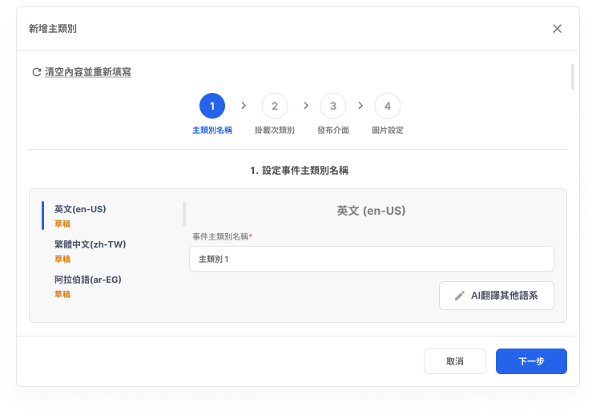
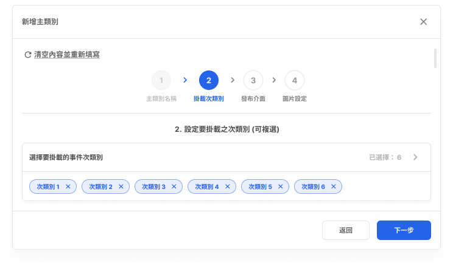
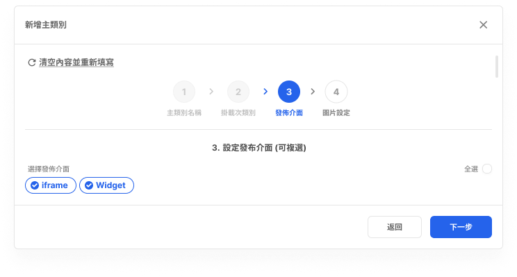
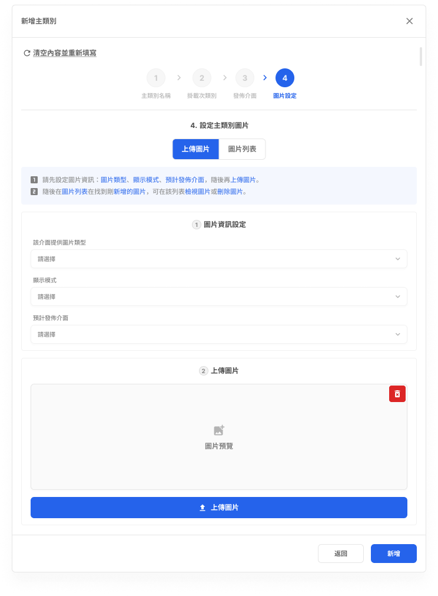

# 新增事件主類別

- 文件狀態：可供查詢，部分規則待確認
- 所屬模組：資料庫管理
- 最後更新：2026-09-23

## 功能說明

用來建立新的事件主類別，依序設定名稱、掛載的事件次類別、發布介面與圖片。

## 畫面與簡單說明

### Step 1：設定主類別名稱

- 輸入事件主類別名稱。
- 畫面目前顯示英文、繁體中文與阿拉伯語系的內容區。
- [在 Figma 開啟來源畫面](https://www.figma.com/design/UX9EY190SGnpNiowHlwiUB?node-id=198-261139)

### Step 2：掛載事件次類別

- 選擇要掛載到這個主類別的事件次類別。
- 畫面中的「已選擇：6」與六個次類別為示意狀態，不代表固定數量或上限。
- [在 Figma 開啟來源畫面](https://www.figma.com/design/UX9EY190SGnpNiowHlwiUB?node-id=198-261304)

### Step 3：選擇發布介面

- 選擇要發布的介面，例如 iframe 或 Widget。
- 畫面標示為可複選；是否可以完全不選仍待確認。
- [在 Figma 開啟來源畫面](https://www.figma.com/design/UX9EY190SGnpNiowHlwiUB?node-id=198-261900)

### Step 4：設定與上傳圖片

- 先設定圖片類型、顯示模式與預計發布介面，再上傳圖片。
- 圖片格式、尺寸、容量與數量限制仍待確認。
- [在 Figma 開啟來源畫面](https://www.figma.com/design/UX9EY190SGnpNiowHlwiUB?node-id=198-261452)

## 操作流程

1. 輸入事件主類別名稱。
2. 選擇要掛載的事件次類別。
3. 選擇發布介面。
4. 設定或上傳圖片；新增後的系統結果仍待確認。

一次只會顯示一個作用中的步驟。

## 各單位可以先使用的資訊

| 單位 | 可使用資訊 |
|---|---|
| 規劃／產品 | 可依四步驟規劃功能；細部規則仍需確認。 |
| 前端 | 有電腦／平板與手機畫面，並有一般、輸入、錯誤或完成等畫面狀態。 |
| 後端 | 可以知道送出前會收集名稱、次類別、發布介面與圖片；資料格式與 API 尚未記錄。 |
| QA | 可以先驗證步驟順序與單一步驟顯示；欄位驗證與限制尚未記錄。 |

## 待確認

- 哪些角色可以新增事件主類別。
- Step 2 是否可以完全不選，以及最多可以選幾個。
- Step 3 是否可以不選任何發布介面。
- 圖片是否必填，以及格式、尺寸、容量與數量限制。
- 返回、關閉或取消時，已輸入資料是否保留。
- 新增成功後何時生效，以及會導向哪個畫面。

## Review

- [ ] 功能用途正確
- [ ] 流程順序正確
- [ ] 畫面連結正確
- [ ] 沒有明顯遺漏

需要追查詳細來源時，可查看[內部詳細資料](../product/v1.0/flows/create-event-main-category-flow.md)。
