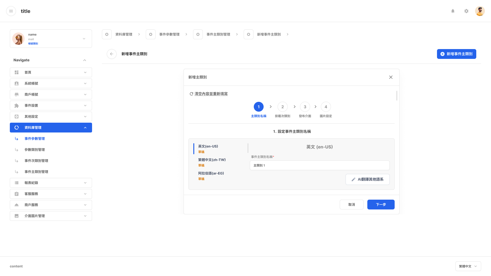
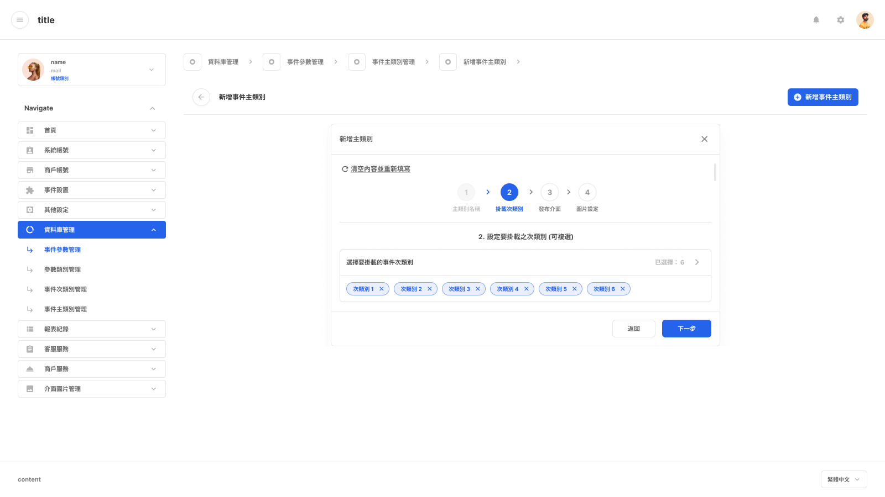
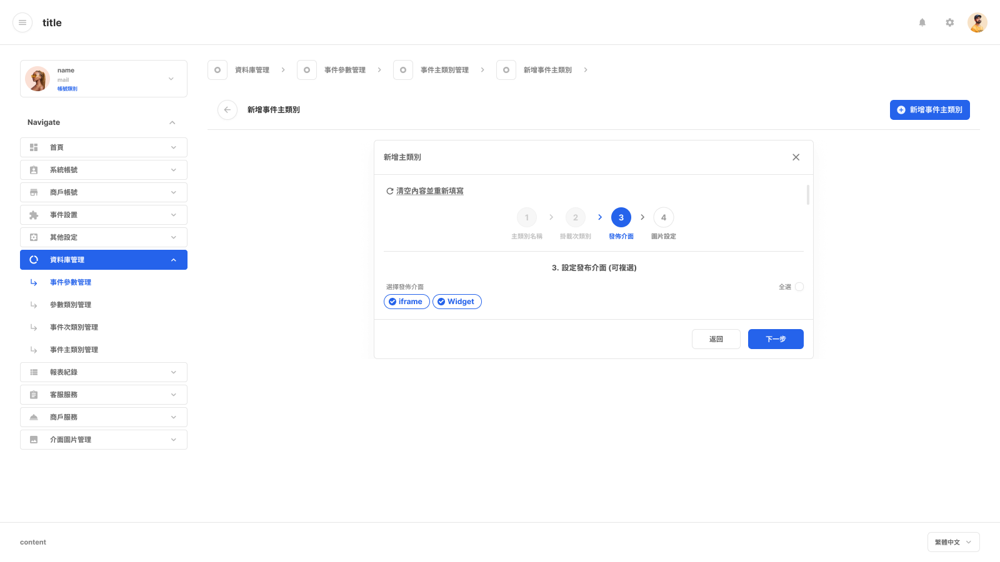
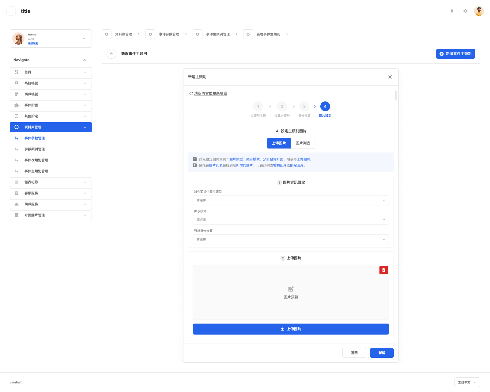

# 新增事件主類別

- 文件狀態：可供查詢，部分規則待確認
- 所屬模組：資料庫管理
- 最後更新：2026-09-29

## 功能說明

用來建立新的事件主類別。目前流程分成 4 個步驟，依序設定：

1. 主類別名稱。
2. 掛載的事件次類別。
3. 發布介面。
4. 主類別圖片。

現有來源已確認 Step 1～Step 4 屬於同一個新增流程，且同一時間只顯示一個作用中的步驟。

## 畫面與操作流程

### Step 1：設定主類別名稱

- 使用者在這一步設定事件主類別名稱。
- 畫面目前顯示英文 `en-US`、繁體中文 `zh-TW` 與阿拉伯語 `ar-EG`。
- 各語系旁目前顯示「草稿」狀態，並可切換不同語系的內容區。
- 名稱欄位標示為「事件主類別名稱＊」。
- 畫面提供「AI 翻譯其他語系」、「下一步」、「取消」及「清空內容並重新填寫」。
- 欄位是否必填、允許字數、輸入格式及各語系之間的關係仍待確認。
- [在 Figma 開啟來源畫面](https://www.figma.com/design/UX9EY190SGnpNiowHlwiUB?node-id=198-261139)

### Step 2：掛載事件次類別

- 使用者在這一步選擇要掛載到目前主類別的事件次類別。
- 畫面標題為「設定要掛載之次類別（可複選）」。
- 畫面提供「選擇要掛載的事件次類別」入口，並顯示目前已選數量。
- 已選擇的次類別以標籤呈現，畫面顯示可移除個別標籤。
- 可以按「返回」回到 Step 1，或按「下一步」進入 Step 3。
- 畫面上方提供「清空內容並重新填寫」。
- 畫面中的「已選擇：6」與六個次類別只代表目前畫面狀態，不代表固定數量或上限。
- [在 Figma 開啟來源畫面](https://www.figma.com/design/UX9EY190SGnpNiowHlwiUB?node-id=198-261304)

### Step 3：選擇發布介面

- 使用者在這一步設定事件主類別要發布的介面。
- 畫面標題為「設定發布介面（可複選）」。
- 發布介面目前顯示 `iframe` 與 `Widget`，並提供「全選」。
- 畫面顯示可同時選擇多個發布介面。
- 可以按「返回」回到 Step 2，或按「下一步」進入 Step 4。
- 畫面上方提供「清空內容並重新填寫」。
- 是否允許完全不選任何發布介面仍待確認。
- [在 Figma 開啟來源畫面](https://www.figma.com/design/UX9EY190SGnpNiowHlwiUB?node-id=198-261900)

### Step 4：設定主類別圖片

- 使用者在這一步設定與上傳主類別圖片。
- 畫面提供「上傳圖片」與「圖片列表」兩個分頁，目前截圖選中「上傳圖片」。
- 上傳前，畫面目前顯示圖片類型、顯示模式及預計發布介面的設定欄位。
- 畫面提供圖片預覽區、刪除按鈕與「上傳圖片」按鈕。
- 可以按「返回」回到 Step 3，或按「新增」。
- 畫面上方提供「清空內容並重新填寫」。
- 圖片是否必填，以及格式、尺寸、容量與數量限制仍待確認。
- [在 Figma 開啟來源畫面](https://www.figma.com/design/UX9EY190SGnpNiowHlwiUB?node-id=198-261452)

## 各單位可以先使用的資訊

### 產品規劃

- 此功能用來建立新的事件主類別。
- 新增流程分成 Step 1～Step 4，依序處理名稱、次類別、發布介面及圖片。
- Step 2 與 Step 3 畫面標示可複選。
- Step 4 畫面提供圖片上傳與圖片列表分頁。
- 權限、欄位限制、資料處理與新增結果等細部規則仍待確認。

### 前端

- 流程共有 4 個步驟，同一時間只呈現一個作用中的步驟。
- 內部詳細來源記錄了電腦／平板與手機畫面，以及一般、輸入、錯誤或完成等相關畫面狀態；狀態的實際觸發條件仍待確認。
- Step 1 有多語系內容區。
- Step 2 有多選及已選標籤的呈現。
- Step 3 有發布介面多選及全選畫面。
- Step 4 有圖片資訊設定、圖片上傳及圖片列表入口。

### 後端

目前只能確認新增流程會收集或設定名稱、次類別、發布介面與圖片等資料：

- 事件主類別名稱。
- 掛載的事件次類別。
- 發布介面。
- 主類別圖片。

API、Request／Response、資料型別、驗證規則、保存方式、新增結果與生效時間尚未記錄。

### QA

目前可以依現有畫面確認：

- 步驟順序為 Step 1 → Step 2 → Step 3 → Step 4。
- 每個畫面只顯示一個作用中的 Step。
- Step 1～Step 4 的基本前後切換。
- Step 2 可呈現多筆已選次類別。
- Step 3 可呈現多個發布介面選項。
- Step 4 顯示圖片上傳與圖片列表入口。

目前無法從來源建立完整的欄位驗證、錯誤處理與成功結果驗收條件。

## 已確認規則

1. Step 1～Step 4 屬於同一個「新增事件主類別」流程。
2. 流程依 Step 1～Step 4 順序呈現。
3. 同一時間只顯示一個作用中的 Step。

其他從畫面看到的文字與操作方式，只記錄為「畫面目前顯示」，不延伸為產品規則。

## 待確認

### 權限

- 哪些角色可以新增事件主類別。
- 是否有其他權限條件。

### Step 1：主類別名稱

- 主類別名稱是否必填。
- 名稱的字數限制。
- 可輸入的內容或格式限制。
- 各語系是否都有必填要求。
- 不同語系資料之間的保存與送出規則。

### Step 2：掛載事件次類別

- 是否可以完全不選事件次類別。
- 最多可以選擇幾個事件次類別。
- 是否有其他選擇限制。

### Step 3：發布介面

- 是否可以完全不選發布介面。

### Step 4：圖片

- 圖片是否必填。
- 支援哪些圖片格式。
- 圖片尺寸限制。
- 圖片容量限制。
- 圖片數量限制。

### 返回、取消、關閉與清空

- 返回前一步後，原本已輸入或已選擇的資料是否保留。
- 關閉視窗時，已輸入資料如何處理。
- 按下「取消」時，已輸入資料如何處理。
- 使用「清空內容並重新填寫」時，是否需要再次確認。
- 關閉、取消或清空後，資料是否會被保存。

### 驗證與錯誤處理

- 各欄位實際驗證條件。
- 各步驟錯誤畫面的觸發條件。
- 驗證失敗時的錯誤訊息。
- API 失敗或其他系統錯誤如何處理。

### 新增結果

- Step 4 按下「新增」後實際會建立哪些資料。
- 新增成功的判定方式。
- 新增成功後何時生效。
- 新增成功後導向哪個畫面。
- 新增失敗時如何處理。

## Review

- [x] 功能名稱與用途正確
- [x] 四張圖片與步驟分組正確
- [x] 已確認規則有來源支持
- [x] 待確認內容沒有被寫成確定事實

需要追查詳細來源時，可查看[內部詳細資料](../product/v1.0/flows/create-event-main-category-flow.md)。
