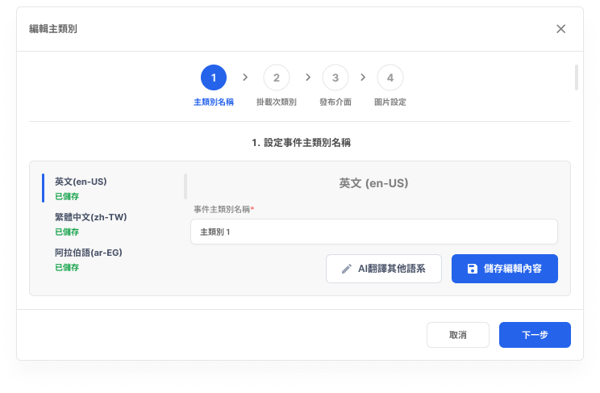
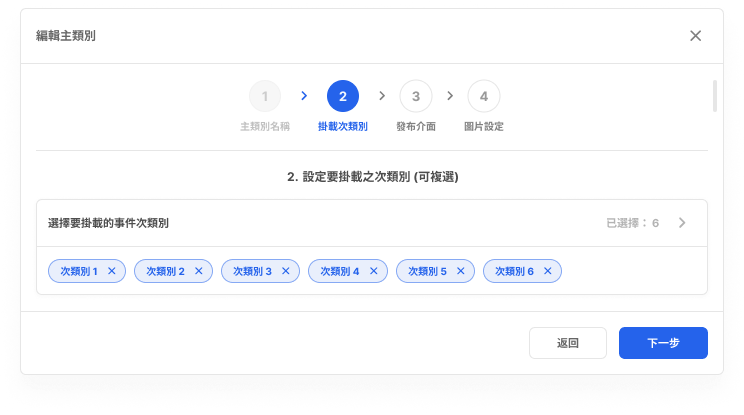
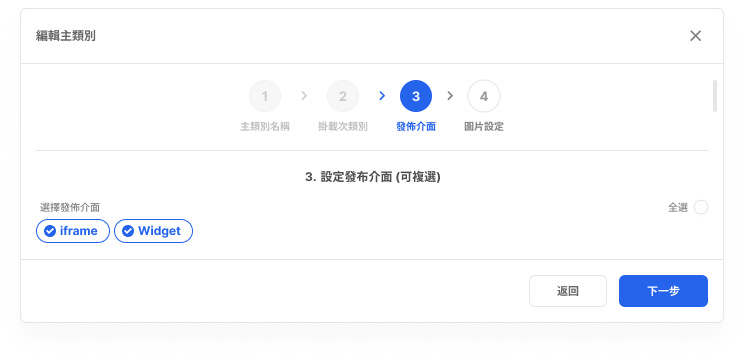
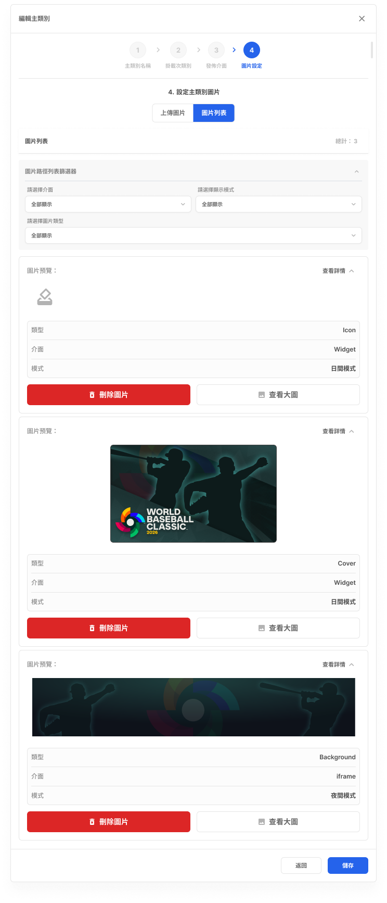
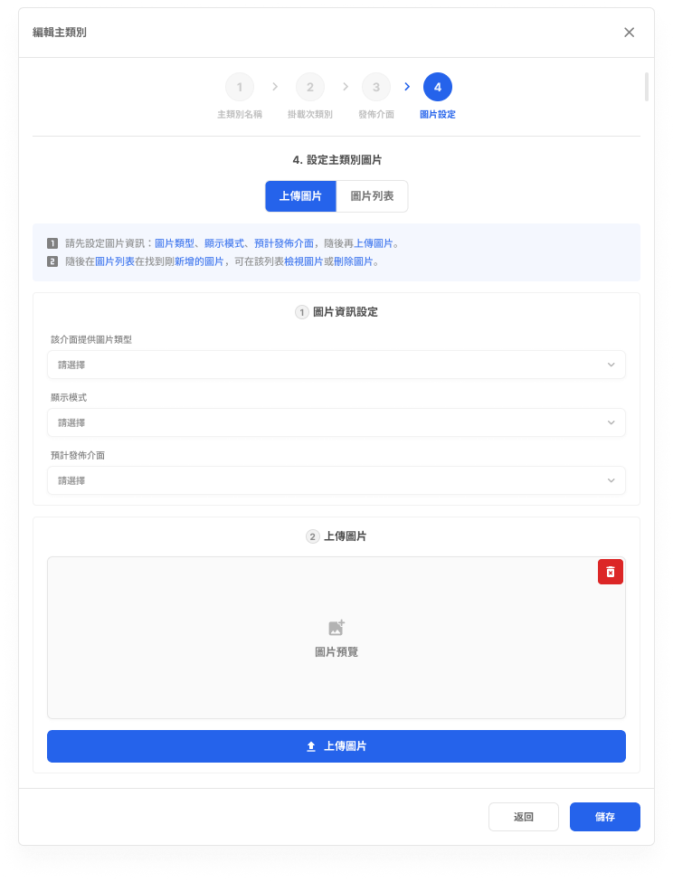

# 編輯事件主類別

- 文件狀態：可供查詢，部分規則待確認
- 所屬模組：資料庫管理
- 最後更新：2026-09-23

## 功能說明

用來修改既有事件主類別的名稱、掛載次類別、發布介面與圖片。

## 畫面與簡單說明

### Step 1：修改主類別名稱

- 顯示既有的主類別名稱與各語系保存狀態。
- 可修改名稱，並可使用「AI 翻譯其他語系」或「保存編輯內容」。
- [在 Figma 開啟來源畫面](https://www.figma.com/design/UX9EY190SGnpNiowHlwiUB?node-id=198-262048)

### Step 2：修改掛載事件次類別

- 顯示目前掛載的事件次類別，供使用者調整選擇。
- 是否可以全部清空、最多可選幾個仍待確認。
- [在 Figma 開啟來源畫面](https://www.figma.com/design/UX9EY190SGnpNiowHlwiUB?node-id=198-262199)

### Step 3：修改發布介面

- 調整主類別要發布的介面，例如 iframe 或 Widget。
- 是否可以不選任何介面仍待確認。
- [在 Figma 開啟來源畫面](https://www.figma.com/design/UX9EY190SGnpNiowHlwiUB?node-id=198-262591)

### Step 4：查看圖片列表

- 查看已存在的圖片，並可依介面、顯示模式與圖片類型篩選。
- 畫面提供查看大圖與刪除圖片操作；實際刪除規則仍待確認。
- [在 Figma 開啟來源畫面](https://www.figma.com/design/UX9EY190SGnpNiowHlwiUB?node-id=198-262492)

### Step 4：上傳圖片

- 設定圖片類型、顯示模式與預計發布介面，再上傳圖片。
- 圖片格式、尺寸、容量與數量限制仍待確認。
- [在 Figma 開啟來源畫面](https://www.figma.com/design/UX9EY190SGnpNiowHlwiUB?node-id=198-262323)

## 操作流程

1. 修改既有主類別名稱。
2. 修改掛載的事件次類別。
3. 修改發布介面。
4. 查看、增加或調整圖片。

一次只會顯示一個作用中的步驟。圖片列表與圖片上傳都屬於第 4 步。

## 各單位可以先使用的資訊

| 單位 | 可使用資訊 |
|---|---|
| 規劃／產品 | 可依四步驟規劃編輯流程；修改與取消規則仍需確認。 |
| 前端 | 有電腦／平板與手機畫面，以及一般、輸入與錯誤等畫面狀態。 |
| 後端 | 可以知道會修改名稱、次類別、發布介面與圖片；資料更新與同步規則尚未記錄。 |
| QA | 可以先驗證步驟順序、既有資料顯示及 Step 4 兩種畫面；驗證條件尚未記錄。 |

## 待確認

- 哪些角色可以編輯，以及不同角色可修改哪些欄位。
- Step 2 修改掛載次類別時是否可以全部清空，以及最多可選幾個。
- Step 3 是否可以不選任何發布介面。
- Step 4 圖片格式、尺寸、容量、數量與刪除既有圖片的規則。
- 返回、關閉、取消或清空時，如何保留或還原既有資料。
- 編輯完成後何時生效，以及是否同步至其他系統。
- 各欄位錯誤狀態的觸發條件。

## Review

- [ ] 功能用途正確
- [ ] 流程順序正確
- [ ] 畫面連結正確
- [ ] 沒有明顯遺漏

需要追查詳細來源時，可查看[內部詳細資料](../product/v1.0/flows/edit-event-main-category-flow.md)。
