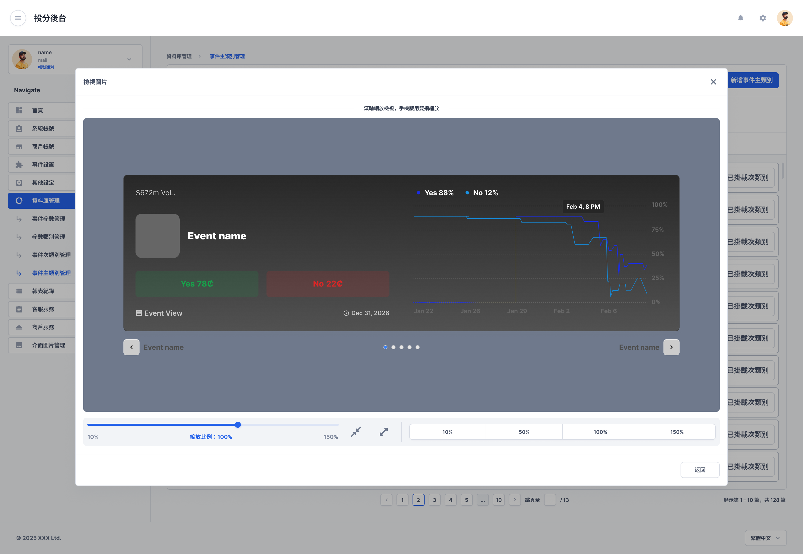
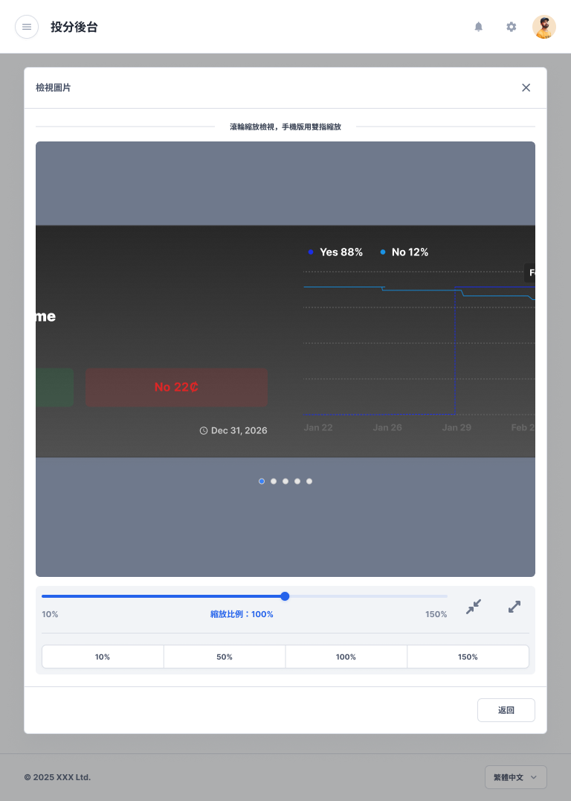
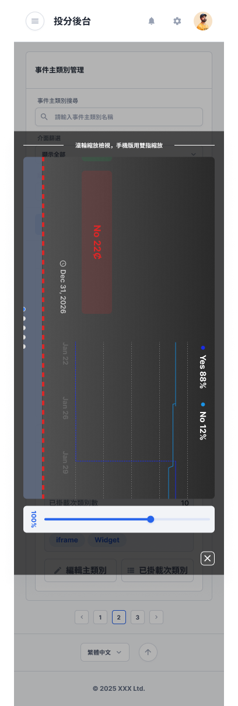

# 事件主類別圖片檢視

- 文件狀態：可供查詢，部分規則待確認
- 所屬模組：資料庫管理
- 最後更新：2026-09-29

## 功能說明

用來放大查看事件主類別圖片。桌機、平板與手機都有對應畫面，並提供縮放操作。

## 畫面與簡單說明

### 桌機版

- 以圖片檢視層顯示大圖。
- 可透過畫面上的縮放控制調整檢視比例。
- [在 Figma 開啟來源畫面](https://www.figma.com/design/UX9EY190SGnpNiowHlwiUB?node-id=198-280336)

### 平板版

- 以平板版圖片檢視層顯示大圖。
- 可使用縮放控制調整檢視比例。
- [在 Figma 開啟來源畫面](https://www.figma.com/design/UX9EY190SGnpNiowHlwiUB?node-id=198-280374)

### 手機版

- 以適合窄螢幕的方式顯示大圖。
- 可透過手機版縮放操作調整檢視比例。
- [在 Figma 開啟來源畫面](https://www.figma.com/design/UX9EY190SGnpNiowHlwiUB?node-id=198-280400)

## 操作流程

1. 從事件主類別的圖片操作開啟圖片檢視。
2. 查看大圖，並依需要調整縮放比例。
3. 關閉圖片檢視後返回原畫面。

## 各單位可以先使用的資訊

| 單位 | 可使用資訊 |
|---|---|
| 規劃／產品 | 可確認圖片檢視支援桌機、平板與手機，以及基本縮放操作。 |
| 前端 | 可依三種裝置畫面實作檢視層與縮放控制；詳細縮放數值規則仍待確認。 |
| 後端 | 目前只能確認需要提供可檢視的圖片；圖片來源與存取規則尚未記錄。 |
| QA | 可先檢查三種裝置是否能開啟、縮放及關閉圖片；邊界與錯誤狀態仍待確認。 |

## 待確認

- 哪些角色可以查看圖片。
- 縮放的最小值、最大值與每次調整幅度。
- 是否支援下載、另開原圖或其他圖片操作。
- 圖片載入失敗、圖片不存在或權限不足時的顯示方式。
- 關閉後是否需要保留前一次的縮放比例。

## Review

- [x] 功能名稱與用途正確
- [x] 畫面分組正確
- [x] 畫面與 Figma 連結正確
- [x] 未把待確認規則寫成已定案

人工檢閱通過：2026-09-29。
