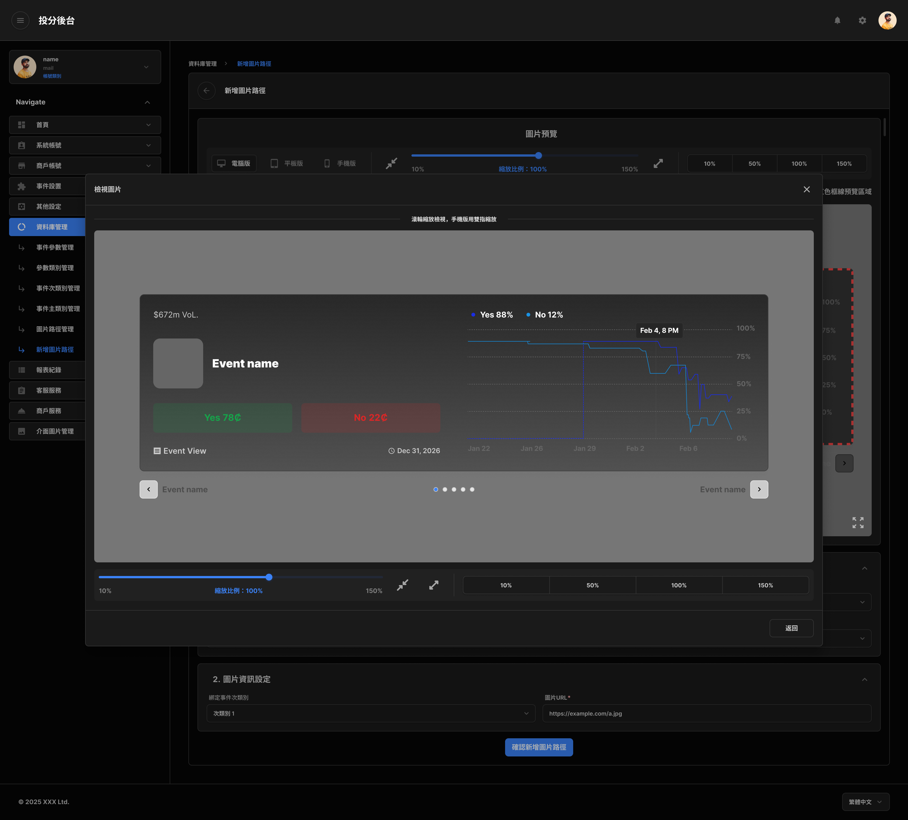
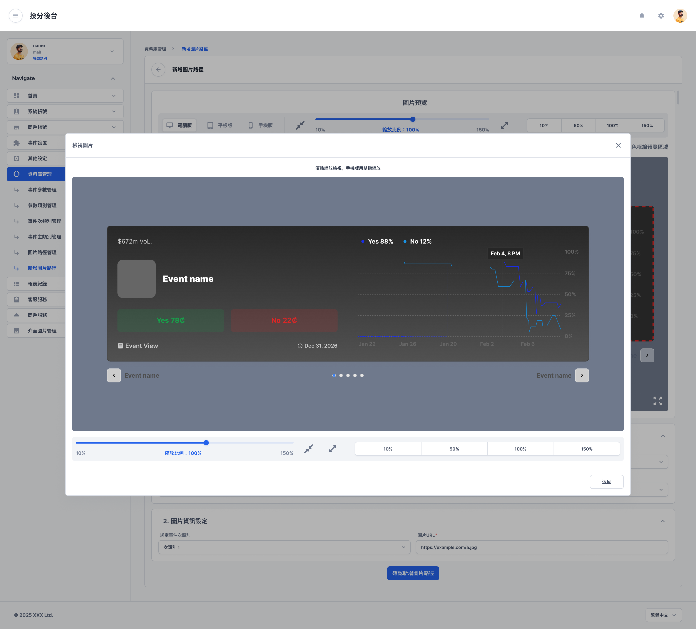
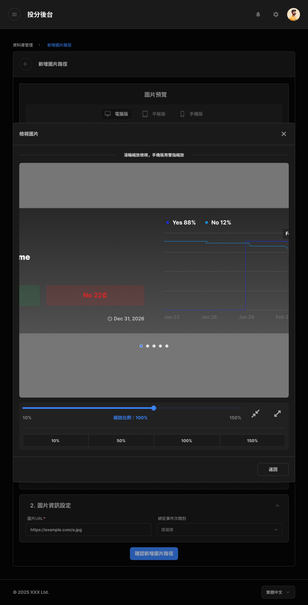
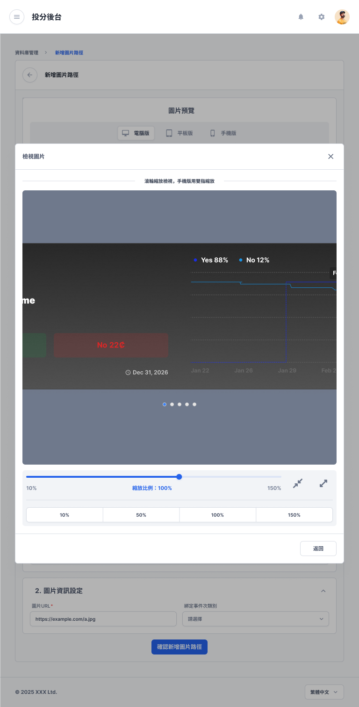
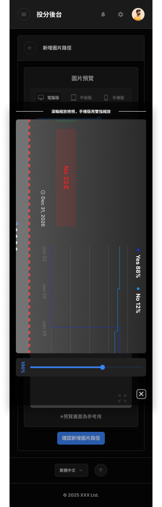
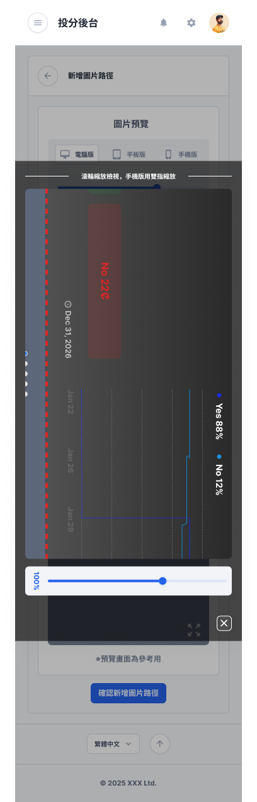

# 圖片路徑圖片檢視

- 文件狀態：可供查詢，部分規則待確認
- 所屬模組：資料庫管理
- 最後更新：2026-09-29

## 功能說明

用來從新增或編輯圖片路徑畫面放大查看圖片。支援桌機、平板、手機以及亮色、暗色主題。

## 畫面與簡單說明

### 桌機暗色版

- 以暗色圖片檢視層顯示大圖及縮放控制。
- [在 Figma 開啟來源畫面](https://www.figma.com/design/UX9EY190SGnpNiowHlwiUB?node-id=190-247127)

### 桌機亮色版

- 以亮色圖片檢視層顯示大圖及縮放控制。
- [在 Figma 開啟來源畫面](https://www.figma.com/design/UX9EY190SGnpNiowHlwiUB?node-id=190-246937)

### 平板暗色版

- 以平板暗色版圖片檢視層顯示大圖及縮放控制。
- [在 Figma 開啟來源畫面](https://www.figma.com/design/UX9EY190SGnpNiowHlwiUB?node-id=190-247193)

### 平板亮色版

- 以平板亮色版圖片檢視層顯示大圖及縮放控制。
- [在 Figma 開啟來源畫面](https://www.figma.com/design/UX9EY190SGnpNiowHlwiUB?node-id=190-247003)

### 手機暗色版

- 以手機直向暗色版畫面顯示圖片及縮放控制。
- [在 Figma 開啟來源畫面](https://www.figma.com/design/UX9EY190SGnpNiowHlwiUB?node-id=190-247066)

### 手機亮色版

- 以手機直向亮色版畫面顯示圖片及縮放控制。
- [在 Figma 開啟來源畫面](https://www.figma.com/design/UX9EY190SGnpNiowHlwiUB?node-id=190-246876)

## 操作流程

1. 從新增或編輯圖片路徑畫面開啟圖片檢視。
2. 查看大圖，並依需要調整縮放比例。
3. 關閉圖片檢視後返回原畫面。

## 各單位可以先使用的資訊

| 單位 | 可使用資訊 |
|---|---|
| 規劃／產品 | 可確認圖片檢視支援三種裝置與亮色、暗色主題。 |
| 前端 | 可依六種畫面組合實作檢視層、圖片方向與縮放控制。 |
| 後端 | 目前只能確認需要提供可檢視的圖片；圖片來源與存取規則尚未記錄。 |
| QA | 可先檢查三種裝置及兩種主題是否能正確開啟、縮放與關閉。 |

## 待確認

- 哪些角色可以查看圖片。
- 縮放的最小值、最大值與每次調整幅度。
- 手機版圖片旋轉方向及不同圖片比例的顯示規則。
- 是否支援下載、另開原圖或其他圖片操作。
- 圖片載入失敗、圖片不存在或權限不足時的顯示方式。

## Review

- [x] 功能名稱與用途正確
- [x] 畫面分組正確
- [x] 畫面與 Figma 連結正確
- [x] 未把待確認規則寫成已定案

人工檢閱通過：2026-09-29。
