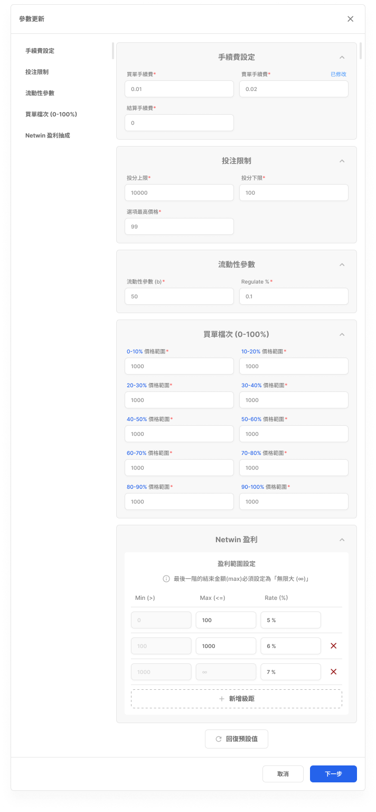
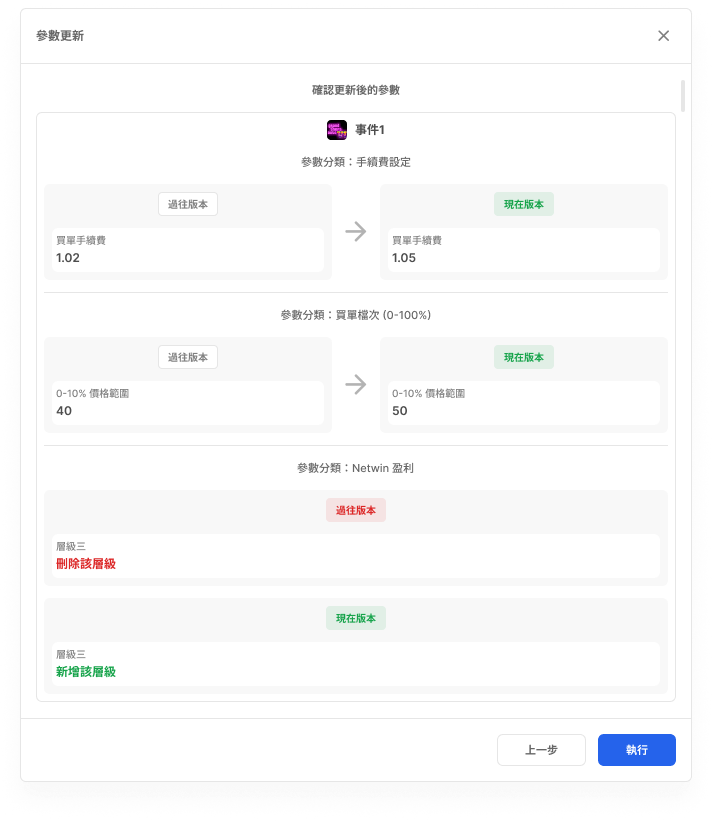

# 單一事件參數更新

- 文件狀態：可供查詢，部分規則待確認
- 所屬模組：事件設置
- 最後更新：2026-09-23

## 功能說明

用來修改單一事件的參數，先編輯內容，再檢查更新前後差異並確認執行。

## 畫面與簡單說明

### Step 1：修改事件參數

- 畫面依參數分類顯示可編輯欄位，例如手續費、投注限制、流動性參數、買單檔次與 Netwin 盈利。
- 欄位的正式定義、資料型別與允許範圍仍待確認。
- [在 Figma 開啟來源畫面](https://www.figma.com/design/UX9EY190SGnpNiowHlwiUB?node-id=121-294671)

### Step 2：確認更新內容

- 顯示過往版本與現在版本，讓使用者送出前確認差異。
- 畫面可呈現數值修改，以及新增或刪除層級等變動。
- [在 Figma 開啟來源畫面](https://www.figma.com/design/UX9EY190SGnpNiowHlwiUB?node-id=121-294470)

## 操作流程

1. 編輯單一事件參數。
2. 檢查更新前後差異並確認執行。

兩個步驟屬於同一流程，而且一次只會顯示一個作用中的步驟。

## 各單位可以先使用的資訊

| 單位 | 可使用資訊 |
|---|---|
| 規劃／產品 | 可依「編輯 → 確認」規劃流程；各參數的正式定義仍需補充。 |
| 前端 | 有電腦／平板與手機畫面；目前索引沒有記錄完整輸入與錯誤狀態。 |
| 後端 | 可以知道送出前有差異確認步驟；API、生效時間與版本規則尚未記錄。 |
| QA | 可以先驗證兩步驟順序、參數分類與差異確認畫面；欄位限制尚未記錄。 |

## 待確認

- 哪些角色可以操作，以及可以更新哪些事件。
- Step 1 各參數的正式定義、欄位、資料型別與允許值。
- Step 1 欄位必填、格式、數值範圍與錯誤條件。
- 返回、關閉或取消時，修改內容如何處理。
- Step 2 確認執行後何時生效，以及是否有版本或同時編輯限制。

## Review

- [ ] 功能用途正確
- [ ] 流程順序正確
- [ ] 畫面連結正確
- [ ] 沒有明顯遺漏

需要追查詳細來源時，可查看[內部詳細資料](../product/v1.0/flows/single-parameter-update-flow.md)。
